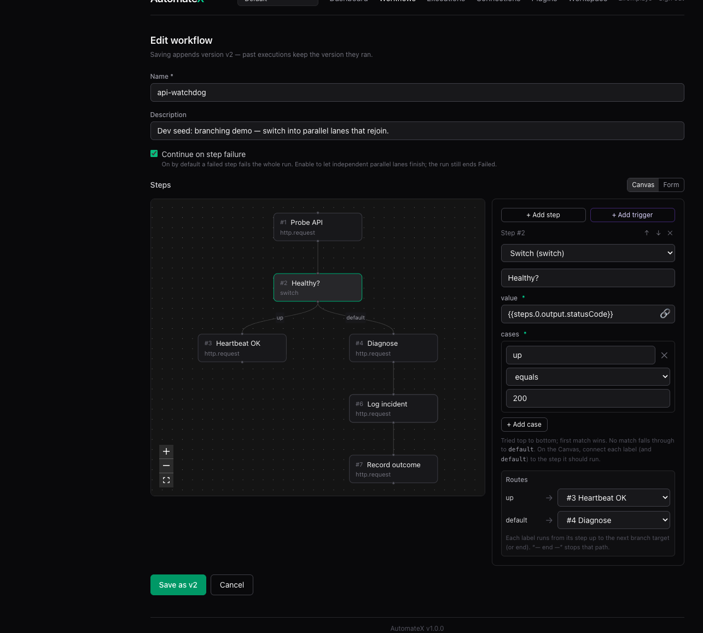
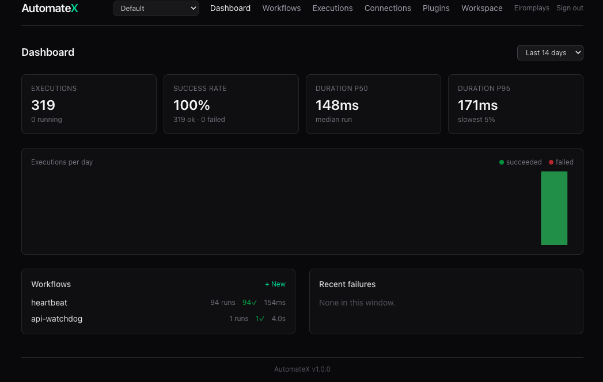
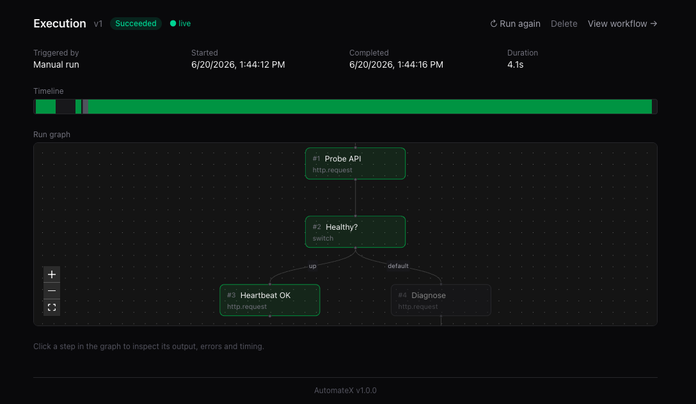
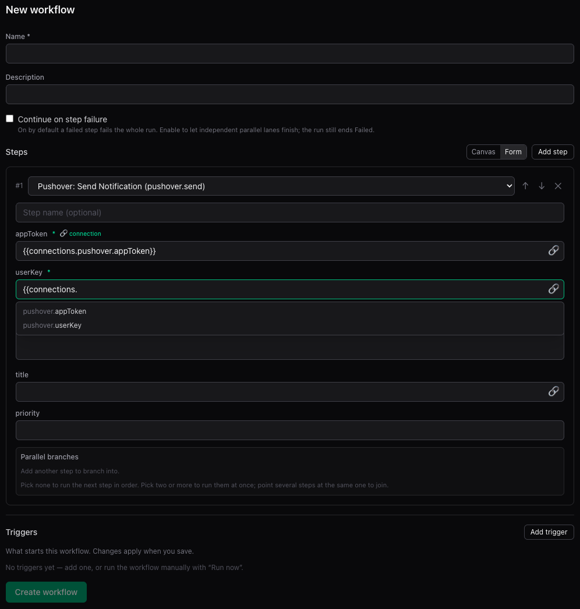

# AutomateX

[](https://github.com/Eiromplays/AutomateX/actions/workflows/ci.yml)

Self-hostable, .NET-native automation engine. Build workflows — sequences (and branches) of **steps**
fired by **triggers** — in a visual builder, run them on a durable engine that survives restarts, and
extend everything with plugins. Think Zapier/n8n, but yours: your hardware, your data, your code.

Release history is in [CHANGELOG.md](CHANGELOG.md). v1 is archived at
[AutomateX-v1](https://github.com/Eiromplays/AutomateX-v1).

## Screenshots

The visual builder — `switch` routing into parallel lanes that rejoin, with continue-on-failure:



The dashboard (execution metrics + per-workflow health) and a live execution run graph:




Every action renders a form from its JSON Schema, with inline `{{connections.…}}` autocomplete on
config fields:



## Highlights

- **Durable engine** — each step is a Postgres-backed Wolverine message with per-step retries and
  backoff; crashes resume from the durable inbox, cron fires via an atomic lease (no double-fires).
- **Visual builder** — graph + forms generated from each action's JSON Schema, with connection-ref
  validation, required-field hints, and inline `{{connections.…}}` autocomplete.
- **Branching & parallel** — `switch`/`gate` routing over an edge-DAG, parallel fan-out lanes that
  join, continue-on-failure, and **try/catch error branches** (an "on error →" edge catches a step's
  failure into a handler lane, with `{{steps.<key>.error}}`).
- **Triggers** — cron, webhook (per-trigger capability secrets), manual, workflow-chaining,
  `execution.onFailure` (fire a workflow when another fails), and plugin triggers (`rss`, `http.poll`,
  `matrix.onMessage`).
- **Actions** — built-in `http.request`, `webhook.send` (HMAC-signed), `gate`, `switch`,
  `transform` (JMESPath), `wait`, `workflow.call`, `forEach`, `kv.*`, `schedule.workflow`,
  `llm.prompt`, `llm.agent`, `mcp.call`;
  first-party plugins `ssh.command`, `matrix.send`, `discord.send`,
  `slack.send`, `telegram.send`, `pushover.send`, `email.send`.
- **Durable wait & approvals** — a `wait` step suspends a run (timer or human approval) into a
  `Waiting` status that survives restarts; resume from the UI or API, and branch on the decision.
  Plus "retry from a step" reusing earlier outputs.
- **Sub-workflows & loops** — `workflow.call` runs another workflow as a step and waits for its
  result; `forEach` maps a workflow over an array, collecting ordered results.
- **Failure alerting & metrics** — an `execution.onFailure` trigger runs a workflow whenever any run
  fails (with the failed step + error as `{{trigger.payload}}`); OpenTelemetry/Prometheus metrics
  export over OTLP and a `/metrics` scrape ([recipe](docs/recipes/failure-alerting.md)).
- **Idempotency keys** — give a step a templated key and the engine caches its first success,
  skipping re-invocation on re-fires and crash redeliveries; `webhook.send` also forwards an
  `Idempotency-Key` header ([recipe](docs/recipes/idempotency.md)).
- **Audit log & instance-admin** — an append-only trail of who changed/ran/deleted what (`GET
  /api/audit` + an Audit page), with an operator role above workspace-owner that sees across
  workspaces ([recipe](docs/recipes/audit-log.md)).
- **Durable KV store** — per-workflow state via `kv.*`; `setIfAbsent` + `gate` gives run-once dedup
  ([recipe](docs/recipes/dedup-and-state.md)).
- **Encrypted connections** — AES-256-GCM secret bundles + OAuth2 connections, referenced as
  `{{connections.<name>.<field>}}`, masked everywhere. Per-workspace data-encryption keys (wrapped by
  the instance key) with one-click rotation and instance-key re-wrap ([recipe](docs/recipes/key-rotation.md)).
- **Workspaces & auth** — viewer/editor/owner roles; auth is open → API key → OIDC (with
  refresh-token sessions).
- **Plugin platform** — plugins contribute actions, triggers, and connection types, each running
  **out-of-process** in its own sandboxed host (own dependency closure; can't crash or read the
  engine); hot-reload, workspace-scoped plugins, and an in-app catalog with sha256-verified installs
  (upload gated behind `Engine__AllowPluginUpload`).
- **Self-hosting** — `docker compose up`, GHCR images on `v*` tags, and a full homelab guide
  (Proxmox + Tailscale HTTPS + OIDC) in [docs/deploy-homelab.md](docs/deploy-homelab.md).

## Stack

.NET 10 · Aspire 13 · Wolverine (Postgres-backed messaging) · EF Core 10 · FastEndpoints · Postgres ·
React Router v7 / React 19 / TanStack Query / Tailwind 4

## Run it

Prerequisites: **.NET 10 SDK**, **Docker** (Aspire starts Postgres), **Node + pnpm**, optionally the
[Aspire CLI](https://aspire.dev).

```bash
dotnet tool restore
aspire run    # api + web (Vite) + Postgres — open the "web" resource
dotnet test   # engine + module tests (needs Docker via Testcontainers)
```

Web app checks (in `src/web`): `pnpm test && pnpm typecheck`.

## Self-host

```bash
dotnet publish src/AutomateX -t:PublishContainer   # builds the automatex-api image
docker compose up -d
open http://localhost:8080                          # UI (8081 = direct API)
```

`v*` tags publish images to GHCR — point the compose `image:` entries at
`ghcr.io/eiromplays/automatex-api:latest` / `automatex-web:latest` to skip local builds. Running 24/7
on a server? Use `docker-compose.prod.yml` + `.env.example`; the full walkthrough (Proxmox, Tailscale
Serve HTTPS, OIDC, updates, backups) is in [docs/deploy-homelab.md](docs/deploy-homelab.md).

- **Plugins**: drop `<Name>/<Name>.dll` into the volume-mounted `./plugins` and restart the api, or
  install from the in-app catalog. See `plugins/README.md`.
- **Auth**: set `Auth__ApiKey` (or OIDC) to gate `/api` + `/hubs`.
- **Encryption**: `Encryption__Key` decrypts connection secrets and is never stored — back it up.
- **Database**: migrations apply on startup; the `automatex-postgres-data` volume holds state.

## Data flow between steps

Step configs are templates. `{{path}}` tokens resolve before each step runs:

```
{{trigger.payload}}            the JSON body sent to the webhook / manual execute call
{{trigger.payload.x.y}}        navigate it (object properties + array indices, camelCase)
{{steps.0.output.body}}        a prior step's output (0-based order)
{{connections.github.token}}   a field from an encrypted connection
{{execution.id}}               {{workflow.id}}
```

A token that is the entire string keeps its JSON type (`"{{steps.0.output.statusCode}}"` → `200`,
not `"200"`); tokens inside longer strings interpolate. Unresolvable paths fail the step immediately
— no retries, the error names the segment that broke.

## Writing a plugin

```csharp
public sealed record GreetConfig(string Name);
public sealed record GreetResult(string Greeting);

[Action("greet.hello", "Greet", Description = "Says hello.")]
public sealed class GreetAction : IAction<GreetConfig, GreetResult>
{
    public Task<GreetResult> ExecuteAsync(GreetConfig config, ActionContext context, CancellationToken ct = default)
        => Task.FromResult(new GreetResult($"Hello {config.Name}!"));
}
```

Plugins implement `IAction<TConfig, TResult>` (actions), `ITriggerListener<TConfig>` (triggers), or
`IConnectionType` (guided connection types — with `IOAuthConnectionType` for OAuth2 and
`IConnectionTester` for a "Test" button) against `AutomateX.Plugin.Sdk`; config/result types export
as JSON Schema and drive the builder forms. Scaffold one:

```bash
dotnet new install ./templates/automatex-plugin
dotnet new automatex-plugin -n MyPlugin
```

First-party plugins live under `src/Plugins`; the sample (echo/delay actions) is in
`samples/AutomateX.SamplePlugin`. Deploy convention: `plugins/<PluginName>/<PluginName>.dll` **with its
dependency dlls in the same folder** (a normal `dotnet publish`/`build`, or the catalog zip — both
include them); override the root with `Engine__PluginsPath`.

Plugins run **out-of-process** (v4.0): each loads in its own `AutomateX.PluginHost` child with its own
dependency closure, so a plugin can't crash or read the engine. Two rules follow from the boundary:
take services from `ActionContext` (`context.Logger`, `context.Http`) rather than constructor
injection (the host fills only optional ctor params), and note that a plugin can't register engine
event listeners — use a trigger such as `execution.onFailure`. See
[docs/plugin-sandboxing-design.md](docs/plugin-sandboxing-design.md).

## Docs

- Deployment: [homelab guide](docs/deploy-homelab.md)
- Recipes: [self-deploy](docs/recipes/self-deploy.md) ·
  [dedup & durable state](docs/recipes/dedup-and-state.md) ·
  [transform & webhooks](docs/recipes/transform-and-webhooks.md) ·
  [error handling](docs/recipes/error-handling.md) ·
  [approvals & waits](docs/recipes/approvals-and-waits.md) ·
  [sub-workflows & loops](docs/recipes/sub-workflows-and-loops.md) ·
  [failure alerting & metrics](docs/recipes/failure-alerting.md) ·
  [idempotency](docs/recipes/idempotency.md) · [audit log](docs/recipes/audit-log.md) ·
  [key rotation](docs/recipes/key-rotation.md) ·
  [conditional gate](docs/recipes/conditional-gate.md) · [reminders](docs/recipes/reminders.md) ·
  [jarvis-lite](docs/recipes/jarvis-lite.md) · [backups](docs/recipes/backups.md)
- Design notes: [branching](docs/branching-design.md) ·
  [trigger → lane routing](docs/trigger-lane-routing-design.md) ·
  [named step references](docs/steps-references-design.md) ·
  [error branches](docs/error-branches-design.md) ·
  [durable wait](docs/durable-wait-design.md) ·
  [sub-workflows](docs/sub-workflows-design.md) · [forEach](docs/foreach-design.md) ·
  [OAuth connections](docs/oauth-connections-design.md) · [llm.agent](docs/llm-agent-design.md) ·
  [mcp.call](docs/mcp-call-design.md) · [metrics & alerting](docs/metrics-and-alerting-design.md) ·
  [idempotency](docs/idempotency-design.md) · [audit & admin](docs/audit-and-admin-design.md) ·
  [per-tenant DEKs](docs/per-tenant-deks-design.md)

## Contributing & security

See [CONTRIBUTING.md](CONTRIBUTING.md) for setup and conventions, and [SECURITY.md](SECURITY.md) to
report a vulnerability privately. Licensed under [LICENSE](LICENSE).
